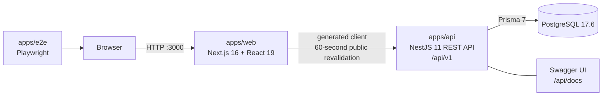
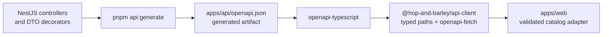

# Hop & Barley Store

Hop & Barley is a full-stack ecommerce portfolio project built as a professional TypeScript monorepo. The repository contains a dependency-aware storefront workspace, REST API, PostgreSQL database, generated API client, and browser test suite.

> **Current status:** the executable platform foundation, catalog discovery and product-detail vertical slices work locally. The complete shop described in the product brief is still being built; planned features are labelled explicitly below.

## What Works Today

- one pnpm workspace orchestrated by Turborepo;
- a Next.js storefront with URL-owned catalog search, category/price filters,
  sorting, pagination, responsive product cards, and server-rendered product
  detail pages;
- a NestJS modular-monolith API with validation, CORS, Helmet, health checks, and graceful shutdown;
- PostgreSQL managed through Prisma schema, committed migration, and deterministic seed data;
- a backend service console at `http://localhost:3001`;
- Swagger UI and an OpenAPI document for the versioned public API endpoints;
- an OpenAPI-generated TypeScript client package;
- a web unit-test baseline, API unit/e2e tests, and a full-stack Playwright smoke test;
- pull-request CI for clean generation, quality/build, PostgreSQL migrations and rollback, and connected/unavailable browser flows;
- one Docker Compose command that starts PostgreSQL, migrations/seed, API, and storefront.

## Local Services

After `pnpm local:up` completes:

| Service         | URL                                                                                    | Purpose                               |
| --------------- | -------------------------------------------------------------------------------------- | ------------------------------------- |
| Storefront      | [http://localhost:3000](http://localhost:3000)                                         | Next.js web application               |
| Backend console | [http://localhost:3001](http://localhost:3001)                                         | Safe API and database status overview |
| Swagger UI      | [http://localhost:3001/api/docs](http://localhost:3001/api/docs)                       | Interactive OpenAPI documentation     |
| Readiness       | [http://localhost:3001/api/v1/health/ready](http://localhost:3001/api/v1/health/ready) | API and PostgreSQL readiness          |
| Products        | [http://localhost:3001/api/v1/products](http://localhost:3001/api/v1/products)         | Seeded catalog endpoint               |
| Product detail  | [http://localhost:3000/product/citra-hops](http://localhost:3000/product/citra-hops)   | Example database-backed detail page   |

## Runtime Architecture



Docker Compose enforces startup order: PostgreSQL becomes healthy, the one-shot migration/seed container completes, the API becomes healthy, and only then the storefront starts.

The browser does not connect to PostgreSQL and does not need the private Docker hostname. Next.js performs its catalog request on the server through `API_INTERNAL_URL=http://api:3001/api/v1`.

## API Contract Pipeline



The contract pipeline is operational end to end. The storefront calls the
generated path through `@hop-and-barley/api-client`, revalidates each canonical
public catalog query for 60 seconds, and validates either the paged C2 envelope
or the exact legacy six-field rollback array before rendering. Malformed
payloads fail closed as `API unavailable` rather than appearing as an empty
catalog. Future authenticated/private requests remain uncached by a separate
security contract.

## Technology Stack

| Area                 | Technology                                              | Role                                                        |
| -------------------- | ------------------------------------------------------- | ----------------------------------------------------------- |
| Runtime              | Node.js `24.5.0`, pnpm `11.21.0`                        | Reproducible workspace runtime and package manager          |
| Monorepo             | Turborepo `2.10.9`                                      | Task graph, caching, and shared root commands               |
| Frontend             | Next.js `16.3.1`, React `19.2.8`, Tailwind CSS `4`      | App Router storefront and server rendering                  |
| Backend              | NestJS `11`, TypeScript, class-validator, Helmet        | Modular REST API and input/security boundaries              |
| API documentation    | `@nestjs/swagger` `11.4.6`, OpenAPI 3                   | Interactive docs and machine-readable contract              |
| Data                 | PostgreSQL `17.6`, Prisma `7.9.1`, `@prisma/adapter-pg` | Relational storage, migrations, seed, and typed data access |
| Typed API client     | `openapi-typescript` `7.13.0`, `openapi-fetch` `0.17.0` | Generated frontend-safe API types and client wrapper        |
| Web tests            | Vitest, React Testing Library                           | Unit and component behavior                                 |
| API tests            | Jest, Supertest                                         | Service rules and HTTP contract                             |
| Browser tests        | Playwright `1.62.1`                                     | Real full-stack user flow                                   |
| Quality              | ESLint 9, Prettier 3, Husky 9, lint-staged, Commitlint  | Static analysis, formatting, and commit discipline          |
| Local infrastructure | Docker Engine + Docker Compose                          | Reproducible web/API/database environment                   |

## Repository Layout

```text
apps/
├── web/                 # Next.js storefront
├── api/                 # NestJS API, Prisma schema/migrations, Swagger
└── e2e/                 # Playwright full-stack tests
packages/
├── api-client/          # OpenAPI-generated TypeScript contract/client
├── eslint-config/       # Reusable lint rules; app adoption is not complete
└── typescript-config/   # Reusable strict TypeScript baselines
.agents/skills/          # Project-local agent workflows
compose.yaml             # Full local development stack
docs/                    # Product brief, architecture blueprint, workflow docs
```

## Quick Start

### Requirements

- Node.js `24.5.0` (see `.node-version` and `.nvmrc`);
- pnpm `11.21.0` through Corepack;
- Docker Engine or Docker Desktop with Compose.

Verify the runtime before installing dependencies:

```bash
node --version
pnpm --version
```

Install dependencies and start the complete local environment:

```bash
corepack enable
pnpm install
pnpm local:up
```

Useful lifecycle commands:

| Command                | Effect                                                                |
| ---------------------- | --------------------------------------------------------------------- |
| `pnpm local:up`        | Build and start the complete local stack, then wait for health checks |
| `pnpm local:logs`      | Follow safe local service logs from web, API, and PostgreSQL          |
| `pnpm local:down`      | Stop containers while preserving the PostgreSQL volume                |
| `docker compose ps -a` | Inspect service and migration-job state                               |

Do not use `docker compose down -v`, delete a volume, or reset Prisma unless the exact destructive action has been explicitly approved.

## Development Commands

| Command                                | Purpose                                                                   |
| -------------------------------------- | ------------------------------------------------------------------------- |
| `pnpm dev`                             | Run workspace development processes in parallel                           |
| `pnpm dev:web`                         | Run the Next.js development server after required workspace builds        |
| `pnpm dev:api`                         | Run only the NestJS watch server                                          |
| `pnpm db:generate`                     | Regenerate Prisma Client after schema changes                             |
| `pnpm db:migrate:dev -- --name <name>` | Create and apply a reviewed local migration                               |
| `pnpm db:seed`                         | Run the deterministic catalog seed                                        |
| `pnpm api:generate`                    | Regenerate OpenAPI and the typed API client                               |
| `pnpm check`                           | Format check, lint, typecheck, unit tests, and production builds          |
| `pnpm check:full`                      | Run `check` plus API/browser e2e tests; the local stack must be available |

Environment templates live at `.env.example` and inside each app. Real `.env*` files and secrets are ignored and must never be committed.

## Current Slice and Planned Shop

Implemented now:

- `Product` and `Category` database models using integer minor currency units;
- repeatable catalog migrations and 12 deterministic products across five categories;
- `GET /api/v1/products`;
- `GET /api/v1/products/:slug` and one responsive detail template for all 12
  products;
- liveness/readiness endpoints;
- database-backed storefront status and catalog rendering;
- canonical URL-backed discovery with search, filters, sorting, pagination,
  loading, empty, invalid, and API-unavailable states;
- developer console, Swagger UI, generated client, and baseline tests.

Planned product work:

- cart and checkout;
- order creation with backend-owned totals and inventory correctness;
- authentication, account, and order history;
- admin catalog/inventory/order flows;
- a production deployment pipeline after a provider decision.

The backend remains a modular monolith. Microservices, Kafka, and distributed transactions are intentionally out of scope until the product has evidence that they are needed.

## Deployment Boundary

No production provider or live deployment is configured. Local development uses Docker Compose; future production delivery should use portable container images and committed Prisma migrations. Vercel, Oracle, or any other provider must be chosen through an explicit architecture decision rather than assumed by the framework.

## Documentation

- [Original product brief](<docs/07 Project M4-1.md>)
- [Monorepo architecture blueprint](docs/hop-and-barley-monorepo-plan.md)
- [Engineering workflow](docs/engineering-workflow.md)
- [Frontend details](apps/web/README.md)
- [Backend and database details](apps/api/README.md)
- [Generated API client package](packages/api-client/README.md)
