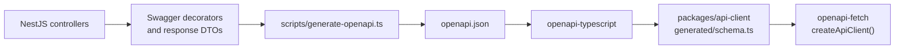

# `@hop-and-barley/api`

The Hop & Barley backend is a NestJS modular monolith. It owns business rules and persistence, exposes a versioned REST API, publishes an OpenAPI contract, and manages PostgreSQL through Prisma migrations.

> **Current slice:** health checks plus read-only catalog discovery and product detail are implemented. Cart, orders, inventory, authentication, users, and admin modules are planned and must be added as real vertical slices rather than empty placeholders.

## Local Entry Points

| Route                        | Purpose                                                             |
| ---------------------------- | ------------------------------------------------------------------- |
| `GET /`                      | Developer service console with safe API/PostgreSQL status and links |
| `GET /api/v1/health/live`    | Process liveness                                                    |
| `GET /api/v1/health/ready`   | API readiness including a real PostgreSQL query                     |
| `GET /api/v1/products`       | Filtered, sorted and paged active USD catalog envelope              |
| `GET /api/v1/products/:slug` | One active USD product detail with ordered specifications           |
| `GET /api/docs`              | Swagger UI generated from the NestJS OpenAPI document               |

Start the complete stack from the repository root with `pnpm local:up`, then open [http://localhost:3001](http://localhost:3001) or [Swagger UI](http://localhost:3001/api/docs).

The service console intentionally shows only safe status lines. Raw application logs are local operator data and remain available through `pnpm local:logs`; they are not exposed through a public endpoint.

## API Contract and Client Generation



Run the complete pipeline from the repository root:

```bash
pnpm api:generate
```

`apps/api/openapi.json` is a generated intermediate artifact and is ignored. `packages/api-client/src/generated/schema.ts` is the generated contract consumed by the client package; never edit it manually.

Swagger is useful from the first endpoint: it makes the current HTTP contract visible, catches missing DTO metadata early, and keeps the generated client aligned. It does not require the API to be publicly deployed.

## Application Structure

```text
src/
├── app.controller.ts       # safe developer service console
├── app-routing.ts          # /api/v1 prefix and root exclusion
├── app.module.ts
├── catalog/                # current Product vertical slice
├── config/                 # environment validation
├── database/               # global Prisma service/module
├── health/                 # liveness and PostgreSQL readiness
├── main.ts                 # validation, CORS, Helmet, Swagger, shutdown
└── openapi.ts
prisma/
├── migrations/             # committed SQL history
├── schema.prisma
└── seed.ts
```

Controllers should remain transport boundaries. Database access belongs in services/repositories, and backend persistence models must not become frontend contracts by accident.

### Catalog discovery contract

`GET /api/v1/products` returns one `{items, meta}` envelope. Optional validated
query parameters are `search`, repeated `category`, `minPriceMinor`,
`maxPriceMinor`, `sort`, `page` and `limit`. Repeated categories use OR logic
because every product has one type. Search is Unicode NFC and uses PostgreSQL
full-text AND semantics across a stored weighted `tsvector` built from product
name, teaser and description; literal wildcard characters are rejected.
Prices are canonical unsigned integer minor units. Page defaults to 1, limit to
12, and the navigable result window is capped at page 200.

Without search, the service uses Prisma filters. With search, parameterized raw
SQL applies `websearch_to_tsquery('simple', ...)` to the indexed
`searchDocument` column for both rows and count. Count, page items, and dynamic
product-backed category facets are read in one `RepeatableRead` transaction.
Facet counts honor search and price filters while deliberately ignoring the
selected category, so the drawer always describes the available catalog. Only
active USD products are public; stock quantity becomes the literal
`in-stock`/`out-of-stock` availability and is never exposed. DTO decorators,
Swagger, and the generated client describe the same envelope.

### P1 product-detail contract

`GET /api/v1/products/:slug` uses the same active-USD visibility boundary as
catalog discovery. The slug is a bounded canonical lowercase value. Unknown,
inactive and non-USD products all return the same generic 404, while successful
responses include the public catalog fields, category summary, derived
availability and the database-ordered specification list. Exact stock quantity,
category foreign keys and persistence flags never cross the DTO boundary.

No schema migration is needed for this slice: the accepted C1 Product model
already owns the ordered JSON specification data. Service, HTTP, OpenAPI,
generated-client and disposable PostgreSQL tests lock the detail contract.

## PostgreSQL and Prisma

The catalog schema contains normalized `Category` and `Product` models. Products
retain UUID identity and a unique slug, store prices as integer minor units, link
to a category, and carry the local image path, ordered JSON specifications,
stock quantity, and active-state metadata needed by the reference catalog.
Prices are not stored as floating-point values.

Common commands from the repository root:

| Command                                | Purpose                                                              |
| -------------------------------------- | -------------------------------------------------------------------- |
| `pnpm db:generate`                     | Regenerate Prisma Client                                             |
| `pnpm db:migrate:dev -- --name <name>` | Create and apply a named local migration                             |
| `pnpm db:migrate:deploy`               | Apply already committed migrations in a deployment-style environment |
| `pnpm db:seed`                         | Upsert deterministic local catalog data                              |

Review generated SQL before accepting a migration. Do not use `prisma db push` as migration history, do not reset a database, and do not delete the Docker volume without explicit approval for the destructive action.

### C1 catalog migration and rollback

The C1 migration adds normalized categories and the catalog fields required by
the reference products. It fails closed if a pre-C1 database contains a product
slug outside the two foundation fixtures or the twelve approved target slugs.
Approved pre-existing rows are preserved but inactive until the transactional
seed replaces their placeholder metadata. The seed then removes only
`house-lager` and `citrus-pale-ale`, upserts the five categories and twelve USD
products by stable keys and IDs, and removes the temporary legacy category.

Run the isolated PostgreSQL 17.6 migration contract without touching the shared
Compose volume:

```bash
pnpm test:catalog:postgres
```

The migration directory includes `rollback.sql` as a reviewed manual structural
rollback. In a backed-up, isolated target it preserves each product's pre-C1
columns and rows while dropping C1-only columns, constraints, indexes and the
category table. The script is intrinsically transactional and fails closed when
the expected C1 objects are missing or an unexpected dependency blocks the
rollback, leaving the pre-attempt schema intact. It intentionally does not
rewrite Prisma's migration ledger; it also does not recreate the two deleted
foundation fixtures or otherwise undo seed data. Restore a backup when data
rollback is required, and coordinate ledger resolution plus a forward recovery
migration before using the script outside an isolated rollback rehearsal. Never
use a reset or volume deletion as rollback.

## Configuration and Security Baseline

`apps/api/.env.example` documents the required values:

- `DATABASE_URL`;
- `PORT` (defaults to `3001`);
- `CORS_ORIGINS` (allowlist, defaults to the local storefront).

At startup the API validates environment input, enables a strict global `ValidationPipe`, adds Helmet headers, enables configured CORS, publishes Swagger, and registers shutdown hooks. Secrets belong in ignored environment files or a future secret manager, never in the repository.

## Tests and Build

From the repository root:

```bash
pnpm --filter @hop-and-barley/api test:unit
pnpm --filter @hop-and-barley/api test:e2e
pnpm --filter @hop-and-barley/api typecheck
pnpm --filter @hop-and-barley/api build
pnpm api:generate
```

The in-process API e2e suite verifies the service console, Swagger UI, health,
raw query-key rejection, exact validation behavior and the OpenAPI catalog
contract with Supertest. The isolated PostgreSQL 17.6 suite verifies upgrade
and fresh migrations, repeated seeding, constraints, exact filtering/paging,
facets, forced concurrent snapshot consistency, a captured EXPLAIN plan and
structural rollback. Future transaction-heavy feature modules should add their
own focused real-PostgreSQL coverage.

## Planned Modules

The target remains one deployable modular monolith:

- catalog and categories;
- inventory;
- cart;
- orders and idempotent checkout;
- authentication and users;
- admin;
- a payment adapter only when a sandbox integration is selected.

Order totals, availability, discounts, permissions, and state transitions must always be recalculated and enforced on the backend. Premature microservices and distributed infrastructure are intentionally out of scope.

## Deployment Boundary

The API has a portable Dockerfile but no selected production provider. A future pipeline should build a versioned image, apply committed migrations as a one-shot step, verify readiness, and retain rollback evidence. No remote deployment is configured today.
