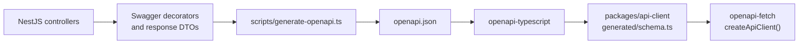

# `@hop-and-barley/api`

The Hop & Barley backend is a NestJS modular monolith. It owns business rules and persistence, exposes a versioned REST API, publishes an OpenAPI contract, and manages PostgreSQL through Prisma migrations.

> **Current slice:** health checks and a read-only seeded product catalog are implemented. Cart, orders, inventory, authentication, users, and admin modules are planned and must be added as real vertical slices rather than empty placeholders.

## Local Entry Points

| Route                      | Purpose                                                             |
| -------------------------- | ------------------------------------------------------------------- |
| `GET /`                    | Developer service console with safe API/PostgreSQL status and links |
| `GET /api/v1/health/live`  | Process liveness                                                    |
| `GET /api/v1/health/ready` | API readiness including a real PostgreSQL query                     |
| `GET /api/v1/products`     | Current seeded product catalog                                      |
| `GET /api/docs`            | Swagger UI generated from the NestJS OpenAPI document               |

Start the complete stack from the repository root with `pnpm local:up`, then open [http://localhost:3001](http://localhost:3001) or [Swagger UI](http://localhost:3001/api/docs).

The service console intentionally shows only safe status lines. Raw application logs are local operator data and remain available through `pnpm local:logs`; they are not exposed through a public endpoint.

## API Contract and Client Generation



Run the complete pipeline from the repository root:

```bash
pnpm api:generate
```

`apps/api/openapi.json` is a generated intermediate artifact and is ignored. `packages/api-client/src/generated/schema.ts` is the generated contract consumed by the client package; never edit it manually.

Swagger is useful from the first endpoint: it makes the current HTTP contract visible, catches missing DTO metadata early, and keeps the generated client aligned. It does not require the API to be publicly deployed.

## Application Structure

```text
src/
├── app.controller.ts       # safe developer service console
├── app-routing.ts          # /api/v1 prefix and root exclusion
├── app.module.ts
├── catalog/                # current Product vertical slice
├── config/                 # environment validation
├── database/               # global Prisma service/module
├── health/                 # liveness and PostgreSQL readiness
├── main.ts                 # validation, CORS, Helmet, Swagger, shutdown
└── openapi.ts
prisma/
├── migrations/             # committed SQL history
├── schema.prisma
└── seed.ts
```

Controllers should remain transport boundaries. Database access belongs in services/repositories, and backend persistence models must not become frontend contracts by accident.

## PostgreSQL and Prisma

The current schema contains a single `Product` model with UUID identity, unique slug, integer `priceMinor`, three-character currency, timestamps, and a name index. Prices are not stored as floating-point values.

Common commands from the repository root:

| Command                                | Purpose                                                              |
| -------------------------------------- | -------------------------------------------------------------------- |
| `pnpm db:generate`                     | Regenerate Prisma Client                                             |
| `pnpm db:migrate:dev -- --name <name>` | Create and apply a named local migration                             |
| `pnpm db:migrate:deploy`               | Apply already committed migrations in a deployment-style environment |
| `pnpm db:seed`                         | Upsert deterministic local catalog data                              |

Review generated SQL before accepting a migration. Do not use `prisma db push` as migration history, do not reset a database, and do not delete the Docker volume without explicit approval for the destructive action.

## Configuration and Security Baseline

`apps/api/.env.example` documents the required values:

- `DATABASE_URL`;
- `PORT` (defaults to `3001`);
- `CORS_ORIGINS` (allowlist, defaults to the local storefront).

At startup the API validates environment input, enables a strict global `ValidationPipe`, adds Helmet headers, enables configured CORS, publishes Swagger, and registers shutdown hooks. Secrets belong in ignored environment files or a future secret manager, never in the repository.

## Tests and Build

From the repository root:

```bash
pnpm --filter @hop-and-barley/api test:unit
pnpm --filter @hop-and-barley/api test:e2e
pnpm --filter @hop-and-barley/api typecheck
pnpm --filter @hop-and-barley/api build
pnpm api:generate
```

The in-process API e2e suite verifies the service console, Swagger UI, health endpoints, and catalog route with Supertest, while Prisma is mocked. The live Docker readiness/catalog checks and Playwright smoke test verify the current full-stack integration, but a dedicated real-PostgreSQL integration suite is still planned for transaction-heavy features.

## Planned Modules

The target remains one deployable modular monolith:

- catalog and categories;
- inventory;
- cart;
- orders and idempotent checkout;
- authentication and users;
- admin;
- a payment adapter only when a sandbox integration is selected.

Order totals, availability, discounts, permissions, and state transitions must always be recalculated and enforced on the backend. Premature microservices and distributed infrastructure are intentionally out of scope.

## Deployment Boundary

The API has a portable Dockerfile but no selected production provider. A future pipeline should build a versioned image, apply committed migrations as a one-shot step, verify readiness, and retain rollback evidence. No remote deployment is configured today.
