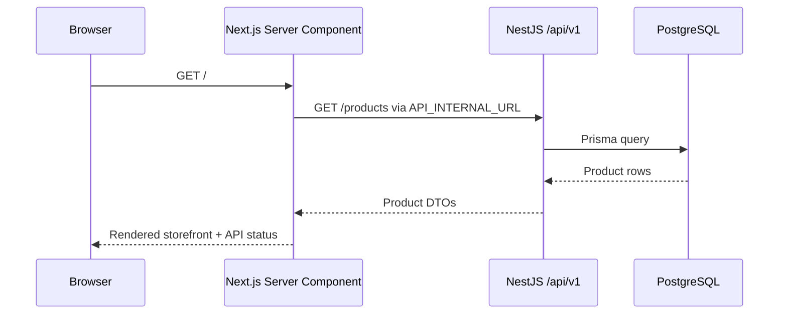

# `@hop-and-barley/web`

The Hop & Barley storefront is a Next.js App Router application. It is independently buildable, but is designed to run with the NestJS API and PostgreSQL database from the repository root.

> **Current slice:** the home page proves server-rendered frontend-to-API-to-database connectivity and displays the seeded catalog. Product details, cart, checkout, authentication, account, and admin flows are planned but are not implemented yet.

## Responsibilities

- render the public storefront and future account/admin interfaces;
- fetch catalog and business data only through the versioned backend API;
- keep secrets and database access on the server;
- provide accessible loading, empty, success, and failure states;
- delegate prices, inventory, permissions, discounts, and final order totals to the backend.

## Request Flow



The API request is server-side. In Docker, `API_INTERNAL_URL` uses the Compose service hostname `api`; that hostname is never sent to the browser.

## Stack

- Next.js `16.3.1` with App Router;
- React `19.2.8`;
- TypeScript with framework-generated route/layout types;
- Tailwind CSS `4` toolchain plus application CSS;
- Vitest, jsdom, and React Testing Library;
- Playwright for full-stack browser verification in `apps/e2e`.

## Environment

| Variable           | Example                        | Purpose                                 |
| ------------------ | ------------------------------ | --------------------------------------- |
| `API_INTERNAL_URL` | `http://127.0.0.1:3001/api/v1` | Server-side API base URL outside Docker |

Docker Compose overrides the value with `http://api:3001/api/v1`.

Do not put backend credentials into `NEXT_PUBLIC_*` variables. Browser-facing API configuration should be introduced only when a real client-side flow requires it.

## Run and Verify

From the repository root:

```bash
pnpm local:up
pnpm --filter @hop-and-barley/web test:unit
pnpm --filter @hop-and-barley/web typecheck
pnpm --filter @hop-and-barley/web build
pnpm --filter @hop-and-barley/e2e test:e2e
```

Open [http://localhost:3000](http://localhost:3000). A healthy full-stack render shows `API connected` and products loaded from PostgreSQL.

## API Client Status

`@hop-and-barley/api-client` already generates typed paths from the backend OpenAPI document. The current home-page slice uses a local `Product` response type and a direct server-side `fetch`. Replacing that boundary with the generated client is planned next; do not claim that the runtime integration is complete until the import and tests prove it.

## Source Layout

```text
src/
├── app/
│   ├── globals.css
│   ├── icon.svg
│   ├── layout.tsx
│   └── page.tsx
└── lib/
    ├── format-price.test.ts
    └── format-price.ts
```

Feature-first folders should be added only with real functionality. The planned direction is `features/catalog`, `features/cart`, `features/checkout`, `features/auth`, and `features/orders`, while route files remain thin.

## Deployment Boundary

The app has a portable Dockerfile, but no production provider is selected. Do not add Vercel-specific deployment configuration by default. Production routing, caching, asset hosting, and same-origin `/api/v1` proxying require a documented architecture decision.
