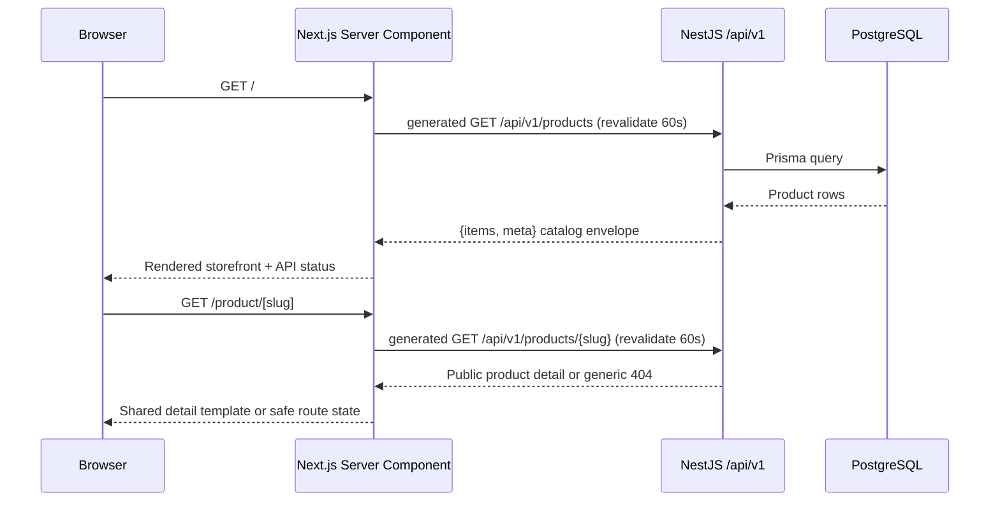

# `@hop-and-barley/web`

The Hop & Barley storefront is a Next.js App Router application. Its workspace build is dependency-aware and builds the generated API client first. The running storefront is designed to use the NestJS API and PostgreSQL database from the repository root.

> **Current slice:** catalog discovery and database-backed product detail pages are server rendered through the generated API client. Cart, checkout, authentication, account, and admin flows are planned but are not implemented yet.

## Responsibilities

- render the public storefront and future account/admin interfaces;
- fetch catalog and business data only through the versioned backend API;
- keep secrets and database access on the server;
- provide accessible loading, empty, success, and failure states;
- delegate prices, inventory, permissions, discounts, and final order totals to the backend.

## Request Flow



The API request is server-side. In Docker, `API_INTERNAL_URL` uses the Compose service hostname `api`; that hostname is never sent to the browser.

## Stack

- Next.js `16.3.1` with App Router;
- React `19.2.8`;
- TypeScript with framework-generated route/layout types;
- Tailwind CSS `4` toolchain plus application CSS;
- Vitest, jsdom, and React Testing Library;
- Playwright for full-stack browser verification in `apps/e2e`.

## Environment

| Variable           | Example                        | Purpose                                 |
| ------------------ | ------------------------------ | --------------------------------------- |
| `API_INTERNAL_URL` | `http://127.0.0.1:3001/api/v1` | Server-side API base URL outside Docker |

Docker Compose overrides the value with `http://api:3001/api/v1`.

Do not put backend credentials into `NEXT_PUBLIC_*` variables. Browser-facing API configuration should be introduced only when a real client-side flow requires it.

## Run and Verify

From the repository root:

```bash
pnpm local:up
pnpm exec turbo run test:unit --filter=@hop-and-barley/web
pnpm exec turbo run typecheck --filter=@hop-and-barley/web
pnpm exec turbo run build --filter=@hop-and-barley/web
pnpm --filter @hop-and-barley/e2e test:e2e
```

Open [http://localhost:3000](http://localhost:3000). A healthy full-stack render shows `API connected` and products loaded from PostgreSQL.

## API Client Status

`@hop-and-barley/api-client` is the runtime and type boundary for the catalog.
`src/lib/catalog.ts` resolves either an origin or the existing terminal
`/api/v1` environment value to one origin, preventing duplicated path prefixes.
It calls the generated `/api/v1/products` path with typed query parameters and
`requestInitExt.next.revalidate = 60`, then passes the response through the
shared list compatibility normalizer. The normalizer returns a discriminated
paged or legacy branch, permits additive future fields, rejects malformed
required structure, and never invents facets, pagination, availability, or
category facts for the legacy branch.

The public `/` route treats the URL as the only discovery state. It validates
and canonicalizes `search`, `category`, price, sort, page, and limit before the
API call. See [Catalog discovery](docs/catalog-discovery.md) for the exact
rendering, responsive, cache, accessibility, and rollback contract.

The `/product/[slug]` route uses the same client boundary and local asset
manifest. It renders image, price, description, public availability and ordered
technical specifications through one server-first template for all twelve
products. Loading, not-found and API-error boundaries are route-owned. See
[Product detail](docs/product-detail.md) for the contract and current deferrals.

## Design Foundation

Production-safe design tokens and the typed local asset manifest live under
`src/styles` and `src/design-system`. The ignored HTML reference and Figma file
are evidence only; neither is a runtime dependency. See
[Design foundation](docs/design-foundation.md) for provenance, responsive
breakpoints, asset behavior, accessibility rules, and validation.

The cross-cutting [quality acceptance matrix](docs/quality-acceptance-matrix.md)
defines route/state coverage, exact responsive probes, WCAG thresholds,
evidence statuses, and the update gate for every future UI slice.

Do not add runtime Google Fonts, Font Awesome, or other CDN assets. Product
images, brand artwork, reviewer illustrations, and header controls are served
from stable local paths under `public/assets`.

## Source Layout

```text
src/
├── app/
│   ├── (catalog)/
│   │   ├── error.tsx
│   │   ├── loading.tsx
│   │   └── page.tsx
│   ├── globals.css
│   ├── icon.svg
│   ├── product/[slug]/
│   │   ├── error.tsx
│   │   ├── loading.tsx
│   │   ├── not-found.tsx
│   │   └── page.tsx
│   └── layout.tsx
├── features/
│   ├── catalog/
│   │   ├── catalog-controls.tsx
│   │   ├── catalog-pagination.tsx
│   │   ├── catalog-query.ts
│   │   └── catalog-screen.tsx
│   └── product-detail/
│       ├── product-detail.module.css
│       └── product-detail.tsx
├── design-system/
│   ├── assets.ts
│   ├── assets.sha256.json
│   ├── design-foundation.test.ts
│   └── tokens.ts
├── lib/
│   ├── catalog.test.ts
│   ├── catalog.ts
│   ├── product-detail.test.ts
│   ├── product-detail.ts
│   ├── format-price.test.ts
│   └── format-price.ts
├── quality/
│   ├── acceptance-matrix.test.ts
│   └── acceptance-matrix.ts
└── styles/
    └── design-tokens.css
```

Feature-first folders are added only with real functionality. Catalog discovery
now lives in `features/catalog`; the planned direction remains `features/cart`,
`features/checkout`, `features/auth`, and `features/orders`, while route files
stay thin.

## Deployment Boundary

The app has a portable Dockerfile, but no production provider is selected. Do not add Vercel-specific deployment configuration by default. Production routing, caching, asset hosting, and same-origin `/api/v1` proxying require a documented architecture decision.
