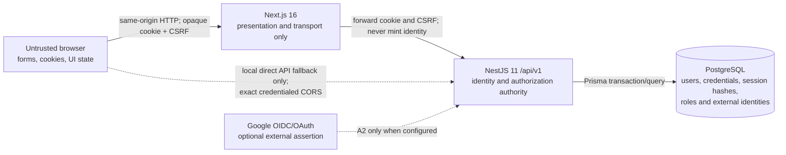

# ADR 0001: NestJS owns authentication, sessions, and authorization

- **Status:** Accepted — independent A0 closure review passed on 2026-08-14
- **Date:** 2026-08-14
- **Decision owner:** A0 Planner
- **Ticket:** [A0 — Decide the authentication and session boundary](https://app.notion.com/p/3bcd78850eab81608392c57242fc9687)
- **Agent Run:** [Planner — A0 authentication and session ADR](https://app.notion.com/p/3bcd78850eab810ebb78cfd095cf270f)
- **Scope:** Authentication and session authority for the local MVP; no implementation is included in this ADR

## Decision summary

**Decided:** NestJS is the single authority for user identity, credentials, sessions, roles, account status, account linking, and every authorization decision. PostgreSQL is the source of truth for those facts.

The browser will hold an opaque, high-entropy session token in a host-only, `HttpOnly` cookie. PostgreSQL will store only a one-way hash of that token. A Nest guard will resolve the session and load the current user status and role for every protected API request. It will never trust role, account ownership, price, or other authorization facts supplied by the browser or by Next.js.

**Decided:** Next.js is a presentation and transport boundary, not a second authentication authority. It may use the presence of the opaque cookie for an optimistic redirect, but secure checks always call NestJS. Next.js must not mint, sign, decrypt, or independently validate a Hop & Barley session.

**Decided:** The core local MVP interprets the brief's “Email” provider as an email identifier plus password. Email magic-link authentication is deferred because it changes the supplied password UX and requires a delivery system that is outside the core local auth path. Google is an optional, Nest-owned linking-only flow for an already password-authenticated user and is disabled safely when credentials are absent.

**Decided:** Auth.js is not installed for the MVP. Its use as the session authority would split the trust boundary between Next.js and the public Nest API. It can be reconsidered only through a new ADR, and only if Nest remains the authority that exchanges an external assertion for a Nest-owned session.

## Evidence and statement labels

This ADR uses these labels:

- **Implemented:** proven by repository code, migrations, tests, or manifests at `0f25d08`.
- **Decided:** the implementation contract selected by this ADR or an existing approved architecture decision.
- **Proposed:** a detailed implementation shape that a later ticket may refine without changing the authority boundary.
- **Unknown:** evidence is unavailable or a later product/infrastructure decision is required.

### Current repository evidence

| Label           | Evidence                                                                                                                                                                                                                                            | Consequence for A0                                                                                            |
| --------------- | --------------------------------------------------------------------------------------------------------------------------------------------------------------------------------------------------------------------------------------------------- | ------------------------------------------------------------------------------------------------------------- |
| **Implemented** | [`apps/web/package.json`](../../apps/web/package.json) uses Next.js `16.3.1` and React `19.2.8`; there is no auth dependency.                                                                                                                       | This is a Next.js 16 App Router decision, not the Next.js 15 route shape in the original brief.               |
| **Implemented** | [`apps/api/package.json`](../../apps/api/package.json) uses NestJS 11; there is no Passport, JWT, cookie, CSRF, password-hash, OAuth, or throttling dependency.                                                                                     | A0 must not claim any auth mechanism already exists, and this ticket must not install one.                    |
| **Implemented** | [`apps/api/prisma/schema.prisma`](../../apps/api/prisma/schema.prisma) and the only committed [migration](../../apps/api/prisma/migrations/20260814104924_init/migration.sql) contain only `Product`.                                               | No user, credential, session, role, external identity, or reset-token persistence exists.                     |
| **Implemented** | [`apps/api/src/main.ts`](../../apps/api/src/main.ts) enables an origin allowlist but does not set CORS `credentials: true`; [`apps/api/src/config/env.validation.ts`](../../apps/api/src/config/env.validation.ts) validates no auth configuration. | Browser cookie auth across the current local origins is not implemented.                                      |
| **Implemented** | [`apps/api/src/app.module.ts`](../../apps/api/src/app.module.ts) exposes health and catalog modules only; the generated [OpenAPI schema](../../packages/api-client/src/generated/schema.ts) has no auth routes or security scheme.                  | Nest guards and typed auth contracts are future A1B work.                                                     |
| **Implemented** | [`apps/web/src/app/page.tsx`](../../apps/web/src/app/page.tsx) makes a server-side catalog fetch without session forwarding.                                                                                                                        | The web app has no session-aware data access layer or protected route.                                        |
| **Decided**     | The [system architecture](../hop-and-barley-monorepo-plan.md) and project ticket keep business rules and permissions in the NestJS modular monolith and preserve a future public Nest API.                                                          | Identity and authorization facts belong with the API, not in a Next-only session database.                    |
| **Decided**     | The [technical brief](<../07 Project M4-1.md>) asks for Google and Email via NextAuth, while the supplied UX contains register, login, forgot-password, and password fields.                                                                        | The brief contains a genuine provider/UX contradiction that A0 must resolve.                                  |
| **Unknown**     | Production provider, public hostname, TLS termination, reverse proxy, and secret manager are undecided.                                                                                                                                             | Cookie and origin policy must be portable and parameterized; no provider-specific configuration belongs here. |

Graphify coverage is unavailable in this worktree because `graphify-out/graph.json` is absent. All implementation statements above were verified directly against source, manifests, migrations, and Git history.

## Context and problem

Hop & Barley has two independently buildable applications:

1. Next.js renders the storefront, protected account UI, admin UI, and Server Actions.
2. NestJS exposes the versioned `/api/v1` contract and is planned to become a public API.

Authentication must therefore answer one question unambiguously: which application is allowed to say who the caller is and what that caller may do?

If Auth.js owns the session in Next.js while NestJS independently owns users and permissions, NestJS must trust a second application's database schema, shared signing secret, callback claims, or introspection endpoint. Roles can become stale, logout can invalidate only one side, and protected API calls can disagree with protected pages. That is dual session authority even when both sides use the same PostgreSQL server.

The smallest reversible design is a Nest-owned database session. It uses infrastructure already present, gives immediate revocation, does not require Google or an email service, and leaves a clear path to a later bearer-token scheme for non-browser API clients.

## Hard constraints

- There must be exactly one authority for identity, session validity, user status, role, and resource authorization.
- The complete local stack must support registration, login, protected API access, logout, and account UI without Google credentials.
- Google must be an optional enhancement, not a startup dependency.
- A2 Google may link only an already password-authenticated user after recent password proof; it creates no user or Google-only account.
- External email delivery is outside the current goal. Password recovery still needs a safe documented local delivery mechanism in A3.
- The browser must never receive a password hash, session-token hash, raw database record, OAuth client secret, or server secret.
- Session tokens must not be stored in `localStorage`, `sessionStorage`, URLs, query parameters, rendered HTML, Server Action return values, logs, Notion, or Git.
- Authenticated, session, CSRF, account, admin, and other user-private responses must never enter a shared or persistent cache. Only request-scoped in-memory deduplication is permitted.
- NestJS remains a provider-neutral modular monolith and owns the `/api/v1` OpenAPI contract.
- The frontend never connects to PostgreSQL or imports backend source.
- Protected Next.js pages, Server Actions, and visual role gates do not replace Nest authorization.
- Local HTTP must work safely; non-local deployments must require HTTPS-only session cookies.
- Current migrations are append-only. No reset, `db push`, volume deletion, or destructive rollback is authorized.
- The decision must preserve a future public Nest API without requiring the public API to depend on Next.js.

## Non-goals

- Selecting a production host, reverse proxy, identity SaaS, secret manager, or email provider.
- Implementing an OAuth2 authorization server for third-party clients.
- Adding multi-factor authentication, passkeys, enterprise SSO, device management, or social providers other than optional Google.
- Implementing auth code, schema migrations, dependencies, secrets, or deployment in A0.
- Treating the local admin seed as a production provisioning design.

## Options considered

| Option                                     | Product fit                                                                                            | Correctness and security                                                                                                                                                                                         | Complexity and operability                                                                                                                    | Portability                                                     | Decision                                                                  |
| ------------------------------------------ | ------------------------------------------------------------------------------------------------------ | ---------------------------------------------------------------------------------------------------------------------------------------------------------------------------------------------------------------- | --------------------------------------------------------------------------------------------------------------------------------------------- | --------------------------------------------------------------- | ------------------------------------------------------------------------- |
| Auth.js owns users and sessions in Next.js | Good fit for Next pages and Google; poor fit for an independently public Nest API                      | Nest must trust Auth.js JWTs, adapter tables, shared secrets, or introspection. Roles/logout can diverge. Current Auth.js docs say Credentials users are not persisted by the provider and require JWT sessions. | Adds Auth.js routes, callbacks, adapter schema, and a Nest verification bridge. Email provider means magic links and delivery infrastructure. | Coupled to the Next application and Auth.js session model.      | Rejected for the MVP.                                                     |
| Nest owns stateless access/refresh JWTs    | Good for non-browser clients and a public API                                                          | Short access tokens reduce but do not remove stale role/status claims; secure rotation, replay detection, refresh-family revocation, and key rotation are required.                                              | More token lifecycle and incident work than the local MVP needs.                                                                              | Provider-neutral.                                               | Rejected for the first browser session; may be a later public-client ADR. |
| Nest owns opaque database sessions         | Fits email/password, protected UI, admin guards, immediate revocation, and future public API ownership | Raw token exists only in the cookie; database stores a hash. Guard resolves current user and permissions on each request. No split authority.                                                                    | Adds one session lookup per protected request and explicit cookie/CSRF handling, but uses existing PostgreSQL.                                | Provider-neutral; Next can be replaced without moving identity. | **Selected.**                                                             |
| Defer authentication                       | Avoids immediate auth work                                                                             | Leaves account, reviews, orders, and admin authorization undefined and encourages feature-local workarounds.                                                                                                     | Low now, much higher rework later.                                                                                                            | Neutral.                                                        | Rejected because A0 blocks P0 implementation.                             |

### Why Auth.js is not the selected owner

Current Auth.js documentation confirms that it can protect App Router pages through `auth()`, supports Google, Email, Credentials, and database or JWT session strategies. It also establishes constraints that matter here:

- the Credentials provider is intended to integrate arbitrary credentials, but Credentials users are not persisted by that provider and the strategy requires JWT sessions;
- the Email provider is passwordless/magic-link behavior, not the password forms in the supplied design;
- automatic OAuth linking by matching an existing email is deliberately disabled by default, and the opt-in is named `allowDangerousEmailAccountLinking`;
- an Auth.js page session still does not make a separate Nest endpoint authorized.

Auth.js would be reasonable if Next.js were the application and data authority. In this repository it would make Nest consume a foreign session contract. Rejecting it is an ownership decision, not a claim that Auth.js is insecure.

### Why opaque sessions precede bearer JWTs

The local MVP already has PostgreSQL and expects immediate logout, password-reset invalidation, user disablement, and admin role changes. A database session makes those events authoritative on the next request. An access/refresh JWT design would need expiry tuning, replay detection, refresh rotation, signing-key rotation, and a rule for stale authorization claims before it provides a practical advantage.

If future third-party or native clients require bearer access, NestJS may add a separate, short-lived bearer-token transport behind the same user and authorization services. It must not turn Auth.js or Next.js into the issuer of Hop & Barley authorization facts.

## Target authority and trust boundaries



### Responsibility map

| Concern              | Browser                  | Next.js                                      | NestJS                                                    | PostgreSQL                                      |
| -------------------- | ------------------------ | -------------------------------------------- | --------------------------------------------------------- | ----------------------------------------------- |
| Capture credentials  | Untrusted form input     | Validate presentation shape; forward         | Validate canonical DTO and authenticate                   | Store only credential hash and metadata         |
| Issue/revoke session | Store cookie only        | Forward `Set-Cookie`/clear-cookie response   | Generate, rotate, validate, and revoke                    | Store token hash, user link, expiry, revocation |
| Current user         | Render returned safe DTO | Call Nest `/auth/session`                    | Resolve session and current user                          | Source of current status/role                   |
| Route redirect       | Follow redirect          | Optional optimistic or secure UI redirect    | N/A                                                       | N/A                                             |
| Resource permission  | No authority             | No authority; may hide controls              | Final guard/service/repository decision                   | Ownership and role facts                        |
| CSRF                 | Send Nest-issued token   | Preserve original origin/token when proxying | Validate origin and token for unsafe cookie-auth requests | Optionally bind token metadata to session       |
| Google identity      | Follow redirect          | Display capability and result                | Validate provider assertion and link account              | Store unique provider identity link             |

### Invariants

1. A valid-looking cookie is not an identity until Nest resolves it to an active, unexpired, unrevoked session and active user.
2. The session cookie contains no role, email, profile, or authorization fact.
3. `request.user`/the Nest principal is constructed only after successful guard validation.
4. Controllers and DTOs never expose persistence models or credential/session fields.
5. Every protected resource operation checks ownership or permission in Nest, even when Next has already redirected or hidden a control.
6. `/account/[id]` must not trust the route `id`. The API should use a self-resource such as `/users/me`, or explicitly require the path ID to equal the authenticated principal.

## User and session data ownership

The exact Prisma names are an A1 implementation detail, but the ownership model is decided:

| Record               | Required ownership and constraints                                                                                                               | Public exposure                                 |
| -------------------- | ------------------------------------------------------------------------------------------------------------------------------------------------ | ----------------------------------------------- |
| `User`               | Nest-owned UUID, normalized unique email, display profile, current status, current role, timestamps                                              | Safe DTO fields only                            |
| `PasswordCredential` | One user link, modern salted memory-hard password hash, algorithm/tuning metadata, changed timestamp                                             | Never                                           |
| `AuthSession`        | Hash of a 256-bit or stronger random token, user link, issued/expiry/revoked timestamps, optional safe device metadata                           | Never raw; session status DTO only              |
| `ExternalIdentity`   | Unique `(provider, providerAccountId)` plus user link and provider email metadata; A2 may add it only to an existing password-authenticated user | Provider label may be shown; tokens never shown |
| `PasswordResetToken` | One-way token hash, user link, expiry, used/revoked timestamp                                                                                    | Never raw except the single delivery event      |

**Decided:** role and account status are read from the current user record during protected-request authentication. They are not cached as authoritative cookie claims. Password reset, password change, account disablement, and high-risk role change revoke all active sessions for that user.

**Proposed:** session rows use a seven-day absolute lifetime for the MVP, with explicit rotation on successful login and any renewal. Rotation transactionally invalidates the old token. The implementation ticket may shorten this after tests, but it must not introduce indefinite sessions or rotate without revoking the previous token.

**Unknown:** the exact password-hashing package and work factor. A1 must select a maintained Argon2id or equivalent memory-hard implementation using current documentation, benchmark it in the project runtime, and record the parameters. The boundary—Nest hashes and verifies; no other app does—is not open.

## Email/password, email links, and recovery

### Core email interpretation

**Decided:** “Email” in the MVP means email address as the login identifier plus password. This matches the supplied login, registration, and forgot-password screens and works with no external credentials.

Registration does not automatically create a long-lived session in A1. A1 creates the user and credential safely; A1B proves login and session establishment as a separate slice.

### Magic links

**Decided:** email magic-link sign-in is deferred. It is not an alternate hidden mode behind the same form. Adding it would require:

- a selected delivery channel and sender identity;
- anti-enumeration and rate-limit behavior;
- token lifecycle and replay rules;
- a product decision about passwordless versus password sign-in;
- an explicit recovery/account-linking interaction.

If later selected, NestJS still owns the one-time token, user, resulting session, and authorization facts. Auth.js Email sessions must not be introduced alongside Nest sessions.

### Password recovery

**Decided:** A3 uses a random, single-use, short-lived reset token whose hash is stored in PostgreSQL. Request responses are identical whether or not an account exists. Successful reset revokes all existing sessions. Tokens must not appear in production-style logs or API success bodies.

**Unknown:** the local delivery adapter. A3 must choose and document a local-only mechanism, such as a local mail sink, that lets a human and Playwright complete the flow without a real external email provider. It must be impossible to enable a token-revealing development adapter accidentally in a non-development environment.

## Optional Google and account linking

**Decided:** Google is implemented in A2 at Nest endpoints as a linking-only enhancement after email/password and browser session slices work. `GOOGLE_CLIENT_ID`, `GOOGLE_CLIENT_SECRET`, and the public callback URL are an all-or-none optional configuration group:

- when all are absent, the API starts, email/password works, the capability endpoint reports Google disabled, and the UI does not offer a dead sign-in action;
- partial configuration fails validation with a secret-free message;
- when enabled, Nest validates the OAuth/OIDC state, nonce where applicable, issuer, audience, expiry, provider subject, and verified-email signal before linking or authenticating an already linked identity;
- provider access/refresh tokens are not browser session tokens and are not returned to the frontend.

**Decided:** A2 does not provide Google-first registration and never creates a Google-only user. A user may link Google only while already authenticated through an active password session, with an existing password credential whose possession was verified by a recent password re-authentication. Safe rules are:

1. If `(google, providerSubject)` already exists, authenticate its linked active user.
2. If the provider identity is new, an unauthenticated callback or login attempt returns a generic linking-required result and creates neither `User` nor `ExternalIdentity`, regardless of whether the Google email is unused or matches a local email.
3. An explicit link begins only from an authenticated, active local user who has a password credential and has just re-proved that password. OAuth state is bound to that user and linking attempt; the callback cannot select a different account by email.
4. Reject the link if the provider subject is already linked to another user. Email equality alone never authorizes linking.
5. After a successful explicit link, later Google sign-in may create a Nest session for that same user. The password credential remains a usable recovery/sign-in method.
6. Linking and unlinking are protected Nest mutations with CSRF protection and audit events. Do not allow unlinking the last usable login method.

This intentionally rejects Auth.js `allowDangerousEmailAccountLinking` behavior for this project. No Google-only user may be introduced before A3 recovery exists. Any later Google-first registration would additionally require A3 to be complete and a new product/security decision; it is not part of A2.

## Cookie, token, CSRF, and CORS contract

### Session cookie

**Decided:** the browser session is an opaque random token with these minimum cookie attributes:

| Attribute  | Local HTTP                           | Non-local HTTPS                                                         |
| ---------- | ------------------------------------ | ----------------------------------------------------------------------- |
| Name       | `hb_session`                         | `__Host-hb_session` when the deployment topology supports the prefix    |
| `HttpOnly` | `true`                               | `true`                                                                  |
| `Secure`   | `false` only for explicit local HTTP | `true`                                                                  |
| `SameSite` | `Lax`                                | `Lax` unless a later cross-site design proves another value is required |
| `Path`     | `/`                                  | `/`                                                                     |
| `Domain`   | omitted (host-only)                  | omitted (required by `__Host-`)                                         |
| Expiry     | explicit `Max-Age`/`Expires`         | explicit `Max-Age`/`Expires`                                            |

No JavaScript session token is exposed. The local browser hostname must be consistent (`localhost`, not a mix of `localhost` and `127.0.0.1`) because host-only cookies do not bridge those hosts.

### Preferred request topology

**Decided target:** browser API calls use same-origin `/api/v1` and are forwarded to NestJS by a provider-neutral network/proxy boundary. Server Components may continue using `API_INTERNAL_URL`, but they must explicitly forward the incoming session cookie when the request is user-specific. A Next rewrite or thin auth proxy may be used only as transport and must preserve every `Set-Cookie` header; it may not implement session logic.

**Proposed local fallback:** while the browser reaches Nest directly at `http://localhost:3001`, Nest must use an exact origin allowlist including `http://localhost:3000`, `credentials: true`, explicit allowed headers, and never `*`. Browser fetches must use `credentials: 'include'`. This fallback must have the same Nest guard and CSRF checks as same-origin traffic.

### CSRF

`HttpOnly` prevents script access to the session token but does not by itself prevent CSRF. `SameSite=Lax` is defense in depth, not the complete control.

**Decided:** Nest applies both controls to cookie-authenticated unsafe methods (`POST`, `PUT`, `PATCH`, `DELETE`):

1. Validate the request `Origin` against a normalized, exact browser-origin allowlist. Do not trust arbitrary `Host`, `X-Forwarded-Host`, or missing-origin traffic by default.
2. Validate a Nest-issued CSRF token from an explicit header against a session-bound value using timing-safe comparison. Safe methods never mutate state.

Pre-authentication login and registration endpoints have no authenticated session to bind. They require the exact Origin check, JSON DTO content, generic results, and dedicated rate limits. A1B may add a signed pre-auth double-submit token if its threat tests show that is required.

Next.js 16 already compares `Origin` to `Host`/`X-Forwarded-Host` for Server Actions, but that protects the Browser → Next hop only. A Server Action that calls Nest must still forward the caller's CSRF token and relevant origin context so Nest can enforce its own boundary. `serverActions.allowedOrigins` must remain empty unless a real reverse-proxy origin requires a reviewed entry.

### CORS

CORS controls which browser origins may read credentialed responses; it is not authentication and is not a substitute for CSRF. A1B must change the current Nest bootstrap only when its tests prove the final topology:

- exact configured origins, no wildcard with credentials;
- `credentials: true` only for the direct-browser topology;
- only required methods and headers, including `Content-Type`, `X-CSRF-Token`, and the request/correlation ID when added;
- no dynamic reflection of an unvalidated Origin;
- server-to-server `API_INTERNAL_URL` calls do not rely on CORS.

### Private response and cache isolation

Authentication and authorization are request-time facts. A response rendered for one session must never be reusable for another session or after logout, revocation, account disablement, password reset, or role change.

**Decided:** every response that observes a session or contains session, CSRF, current-user, account, order-history, admin, or other user-private data carries `Cache-Control: private, no-store` from Nest. Auth endpoints apply it on both success and error responses, including login, logout, current session, CSRF, Google linking/callback, and recovery. Defensive `Vary` values include the request inputs that can change the representation, such as `Cookie`, `Origin`, and a future `Authorization` header, but `Vary` is not permission to store the response.

**Decided:** every authenticated Next server fetch uses `cache: 'no-store'`; it must not set `revalidate`, use `force-cache`, or place authenticated output in ISR/static generation. Authenticated pages and layouts are request-time rendered. A Next Route Handler, rewrite, Server Action, or other transport preserves the upstream `Cache-Control` and `Set-Cookie` headers and adds `private, no-store` if a user-private upstream response omitted it. It never stores the body in a module-level cache.

**Decided:** reverse proxies, CDNs, and future hosting configuration must bypass storage for `/api/v1/auth/*` and every cookie-authenticated/private route. They must honor `private, no-store`, must not strip the relevant `Cookie`, `Set-Cookie`, CSRF, Origin, or cache-control headers, and must never attempt to solve isolation by merely including the session cookie in a shared cache key.

The only permitted optimization is request-scoped in-memory deduplication, such as React `cache()` within one server render/request or a Nest request context. It must be destroyed at the end of that request and may not survive across users, requests, workers, logout, revocation, or role changes. Cross-request session, principal, role, CSRF, or authenticated-response caches require a new ADR and revocation proof.

## Login and authorized mutation sequences

```mermaid
sequenceDiagram
  participant B as Browser
  participant W as Next.js transport
  participant A as NestJS auth API
  participant D as PostgreSQL

  B->>W: POST login form (untrusted input)
  W->>A: POST /api/v1/auth/login + original Origin
  A->>D: Load normalized email + credential
  D-->>A: User and password hash
  A->>A: Verify password; apply rate limit
  A->>D: Store session-token hash and expiry
  A-->>W: Safe user DTO + Set-Cookie + private, no-store
  W-->>B: Preserve Set-Cookie and no-store; redirect

  B->>W: Protected page request + cookie
  W->>A: GET /api/v1/auth/session + forwarded cookie
  A->>D: Resolve token hash + current user status/role
  D-->>A: Active principal
  A-->>W: Safe current-user DTO + private, no-store
  W-->>B: Protected UI

  B->>W: Unsafe mutation + CSRF token
  W->>A: Cookie + CSRF + origin context
  A->>A: Origin, CSRF, session and permission guards
  A->>D: Authorized transaction
  A-->>B: Safe result
```

Any failure in session resolution, user status, CSRF, or authorization stops before the domain write. The system never falls back to a role claimed by Next.js.

## Nest guard and API contract

**Decided:** A1B registers authentication as a global/default-deny Nest guard and marks public endpoints explicitly. Initial public surfaces include the safe service console, health, catalog reads, Swagger according to environment policy, registration, login, and recovery request/complete when delivered. A2's explicit Google-link start is protected by the password session, recent password proof, and CSRF. A Google sign-in/callback endpoint may be public only with its dedicated OAuth state validation and may create a session only for an already linked identity; it is not a generic authorization bypass. New routes are protected unless reviewed as public.

The authenticated principal contains the minimum server-side fields needed for authorization: stable user ID, current role, and current account status. It is attached after guard validation and is not accepted from request headers or DTOs.

**Proposed A1B endpoints and generated contract:**

- `POST /api/v1/auth/register` — implemented in A1; creates a user and credential but no long-lived session.
- `POST /api/v1/auth/login` — verifies credentials and rotates/creates a session.
- `POST /api/v1/auth/logout` — CSRF-protected, revokes the current session, clears the cookie.
- `GET /api/v1/auth/session` — returns a safe current-user/session DTO or `401`.
- `GET /api/v1/auth/csrf` — returns a safe session-bound CSRF token, never a session token.

Controller/DTO metadata must update Swagger and the generated TypeScript client. Cookie authentication should be documented in OpenAPI for the browser scheme; a future bearer scheme must have a distinct name and ADR. Nest applies `private, no-store` centrally to every authenticated/session/CSRF response so a new controller cannot accidentally omit the policy.

## Staged implementation contract

### A1 — user persistence and secure registration

- Add an additive Prisma migration for `User` and `PasswordCredential` following the ownership rules above.
- Normalize email in one tested canonical function and enforce uniqueness in PostgreSQL.
- Validate the password policy at the DTO/service boundary and use a benchmarked modern memory-hard hash.
- Return generic duplicate/credential outcomes; never expose whether an email already exists in a way that enables enumeration.
- Add registration throttling and structured audit outcomes without credential/token data.
- Keep registration independent from session issuance, matching the A1 ticket boundary.
- Prove schema, repository, service, API, OpenAPI/client, and real-PostgreSQL behavior through tests.

### A1B — session transport, login/logout, and guarded API identity

- Add the additive `AuthSession` migration and session repository/service.
- Implement high-entropy token generation, hash-at-rest, absolute expiry, rotation, logout, and all-session revocation service operations.
- Add cookie issuance/clearing with the environment-specific attributes in this ADR.
- Add exact Origin validation, session-bound CSRF, login rate limits, and global/default-deny auth guard with explicit public routes.
- Add central private-response headers for auth/private success and error paths; prove no session, CSRF, or current-user response is cacheable.
- Add `/auth/login`, `/auth/logout`, `/auth/session`, and `/auth/csrf`; update OpenAPI and the generated client.
- Prove that revoked/expired/rotated tokens fail on the next request, current roles are loaded from the database on the next request, and a normal user cannot cross an admin or other-user boundary.

### A1C — browser integration and protected-route UI

- Implement responsive register/login UI using the generated client or a thin typed auth transport adapter.
- Preserve `Set-Cookie`; forward the cookie/CSRF/origin contract without exposing the token to JavaScript storage.
- Use `cache: 'no-store'` for authenticated fetches, keep protected pages request-time rendered, and preserve `private, no-store` through every Next transport.
- Read current identity from Nest for protected pages and header state.
- Use `proxy.ts` only if optimistic redirects materially improve UX. Cookie presence is sufficient for that redirect; it is never sufficient for data access.
- Re-authorize every Server Action through Nest and handle `401`, `403`, API unavailable, expiry, and logout safely.
- Verify the complete local browser journey with Playwright.

### Follow-on A2 and A3

- **A2 Google:** add `ExternalIdentity`, optional capability/configuration, Nest-owned OAuth callback, and explicit linking only for an already password-authenticated user after recent password re-authentication. A2 creates no user and no Google-only account; existing linked users retain password sign-in. Rollback disables the provider without locking out any account.
- **A3 recovery:** add hashed single-use reset tokens, a local delivery adapter, generic request behavior, password reset, and all-session revocation. Real external email remains outside the goal.

## Verification and acceptance evidence

### A0 documentation gate

- Markdown formatting and repository formatting checks pass.
- Every material statement is labelled Implemented, Decided, Proposed, or Unknown.
- Links resolve to tracked repository evidence or authoritative upstream documentation.
- An independent reviewer returns PASS before this ADR becomes accepted and A0 moves to Done.

### Required implementation evidence

- Unit tests for email normalization, password policy/hashing adapter, constant-shape credential failure, token generation/hashing, expiry, rotation, revocation, Origin and CSRF checks, private-response headers, public-route metadata, roles, and linking-only Google rules.
- Real-PostgreSQL integration tests for unique normalized email, concurrent registration, session rotation/revocation, password reset invalidation, and transaction failure.
- Supertest API tests for registration, login success/failure, safe `Set-Cookie` flags, `private, no-store` on every authenticated/session/CSRF success and error response, current session, logout, missing/expired/revoked cookie, CSRF failure, Origin failure, and `401` versus `403` behavior.
- OpenAPI generation plus generated-client diff check for every auth route and safe DTO.
- Web/API integration tests issue the same private URL concurrently as two users and prove neither Nest, Next, nor any proxy reuses another user's body, principal, CSRF token, or role. A response captured before logout/session revocation must not appear on the next fetch or SSR render; a role change must be enforced on the next API request and protected render.
- Playwright tests cover registration → login → protected page → logout, protected redirect, expiry recovery, back/forward navigation after logout, cross-user account isolation, immediate post-revocation and role-change behavior, normal-user admin denial, Google-disabled local mode, and Google linking-only behavior.
- Google acceptance tests prove an unauthenticated or unlinked provider callback creates no user/identity/session, linking requires an existing password credential plus recent password re-authentication and CSRF, an already linked identity can sign in, and disabling Google leaves password login available.
- Security review for session fixation, token replay after revocation, cross-user cache leakage, stale authorization after role change, account enumeration, brute force, IDOR on `/account/[id]`, CSRF, credentialed CORS, unsafe OAuth linking, Google-only account creation, and sensitive-log leakage.

### A2 linking-only acceptance gate

- An unlinked Google subject creates zero `User`, `ExternalIdentity`, and `AuthSession` rows, whether its email is new or matches an existing email.
- Link initiation fails unless the caller has an active password-authenticated session, an existing password credential, recent successful password re-authentication, and a valid CSRF token.
- OAuth state binds the callback to the initiating user and link attempt; email claims cannot select or change the target user.
- After linking, Google sign-in resolves only the stored provider subject and the same current Nest user; password sign-in remains usable.
- Disabling or rolling back Google leaves every linked user able to sign in with the preserved password credential.
- A future change that creates Google-only users is blocked until A3 recovery is complete and a new ADR explicitly accepts that account-recovery model.

No UI flow is accepted from static inspection alone.

## Observability and safe audit events

Nest emits structured, secret-free events with a request/correlation ID:

- registration accepted/rejected by reason category;
- login success/failure/rate-limited without logging the password or raw email as an unbounded label;
- session created, rotated, expired, revoked, or rejected;
- Origin/CSRF rejection;
- authorization denial with route and safe permission code;
- Google enabled/disabled/configuration-invalid and linking conflict;
- password recovery requested/completed without reset token.

Metrics may count outcomes and latency. Logs must never contain passwords, raw session/CSRF/reset/OAuth tokens, cookie headers, provider client secrets, or database hashes. Readiness must not report auth configuration values.

## Failure modes and safe behavior

| Failure                                                               | Required behavior                                                                                                                     |
| --------------------------------------------------------------------- | ------------------------------------------------------------------------------------------------------------------------------------- |
| PostgreSQL unavailable                                                | Login/session validation fails closed with a safe service error; no cached Next role authenticates the request.                       |
| Cookie missing, malformed, expired, rotated, or revoked               | Nest returns `401`; browser clears stale presentation state and offers login.                                                         |
| User disabled or deleted                                              | Session is rejected and revoked; no authorization claim survives in a cookie.                                                         |
| Authenticated user lacks permission                                   | Nest returns `403` without revealing another user's resource.                                                                         |
| Origin or CSRF invalid                                                | Reject unsafe request before the domain service with `403` and a safe audit reason.                                                   |
| Session insert succeeds but response fails                            | Re-login creates a new session; orphaned sessions remain bounded by expiry and can be revoked. The client never guesses success.      |
| Logout response is lost                                               | Server-side revocation still wins; retry is idempotent and cookie clearing is repeated.                                               |
| Google absent or unavailable                                          | Email/password remains fully usable; Google UI is disabled or shows a safe provider-specific error.                                   |
| Partial Google configuration                                          | Startup/config validation rejects the partial provider without printing secrets.                                                      |
| New or unlinked Google identity                                       | Return a generic linking-required result and create no user, external identity, or session.                                           |
| Google link lacks an active password session or recent password proof | Reject the link without revealing whether another local email or account exists.                                                      |
| Next cannot reach Nest                                                | Protected UI shows a service-unavailable state; it never treats inability to verify as anonymous success or authenticated success.    |
| Credentialed CORS misconfigured                                       | Browser request fails closed; diagnostics identify the origin category without reflecting it or exposing credentials.                 |
| Nest, Next, proxy, or CDN attempts to cache a private response        | Treat it as a release-blocking defect; disable the affected route or cache path and do not serve a potentially stored representation. |

## Secret handling

- Commit only variable names and non-secret local examples where safe; never commit generated real values.
- Real local secrets live in ignored `.env*` files. CI/production secrets belong to the future selected platform's secret store.
- Google client secret, password-reset signing/delivery secret if used, and any token-signing key are validated by Nest and never prefixed `NEXT_PUBLIC_`.
- The opaque session-token hash does not require a shared Next/Nest signing secret. Next receives no authority key.
- Secret rotation must support overlap where the selected primitive requires it; exact production rotation is **Unknown** until a deployment platform is selected.
- Tests use deterministic test-only values from isolated test configuration and must never reuse developer or production credentials.

## Consequences

### Positive

- One service decides identity and authorization for web, admin, orders, reviews, and future API consumers.
- Logout, password reset, account disablement, and role changes take effect on the next protected request.
- Explicit `private, no-store` behavior prevents authenticated bodies and authorization facts from crossing users or surviving revocation in shared caches.
- The core local journey works with PostgreSQL only and does not depend on Google or an external email service.
- Next.js can evolve, be separately deployed, or be replaced without migrating the identity authority.
- The browser holds no readable session token, and database leakage alone does not reveal live raw session tokens.
- Swagger/OpenAPI can document the same guarded API that the UI consumes.

### Negative

- Every protected request performs a session/user database lookup unless a later, carefully bounded cache is introduced.
- Nest must implement and test session lifecycle, cookie transport, CSRF, throttling, password hashing, recovery, and OAuth linking instead of delegating the whole flow to Auth.js.
- Same-origin proxying and server-side cookie forwarding require end-to-end tests; a broken transport can look like an auth failure.
- Authenticated pages and API responses cannot use ISR, CDN response caching, or cross-request principal caches; protected reads pay request-time rendering and session lookup cost.
- Database sessions add rows that need expiry cleanup and safe operational visibility.
- Google integration requires a Nest-compatible OAuth/OIDC adapter and callback rather than the shortest Auth.js tutorial path.
- A new user cannot start with Google in A2; they must first register a password account, sign in, and explicitly link Google.

## Rejected shortcuts

- Auth.js session in Next plus a separate Nest session.
- Sharing an Auth.js session secret so Nest can trust Next-owned authorization claims.
- Reading Auth.js adapter tables directly from Nest.
- Putting roles or account status in a long-lived browser JWT and treating them as current.
- Sending bearer/session tokens to browser JavaScript storage.
- Using CORS as CSRF protection or Next Proxy as API authorization.
- Auto-linking Google by matching email while unauthenticated.
- Creating a Google-only user or an `ExternalIdentity` from an unlinked or unauthenticated Google callback in A2.
- Caching a session, principal, role, CSRF response, or authenticated body across requests, even with a cookie-based cache key.
- Making Google or external email credentials mandatory for local startup.
- Logging password-reset links, raw cookies, or tokens for developer convenience.
- Returning a different forgot-password response for existing and non-existing users.

## Rollback and exit strategy

This ADR adds documentation only and can be reverted before implementation without data impact.

After A1, rollback disables registration while preserving the additive user/credential migration and data. After A1B, rollback revokes all `AuthSession` rows, clears the cookie, and disables protected feature entry points while preserving accounts. If a private response may have entered a shared cache, stop the affected route, purge that cache, revoke all potentially exposed sessions, and treat the event as a security incident before re-enabling traffic. Applied migrations are not destructively removed; a forward migration or feature disablement is preferred.

A2 rollback disables Google start, callback, and link endpoints and hides the capability. Because A2 may link only an existing password-authenticated user and must preserve that password credential, every affected user can continue signing in locally. Rollback does not delete users or silently unlink identities; cleanup, if needed, is an explicit audited operation.

Reconsider the decision through a new ADR only when one of these becomes real:

- a third-party public API needs a standards-based OAuth2/OIDC authorization server;
- native or multiple first-party clients demonstrate that database cookies are insufficient;
- a managed identity provider is explicitly selected with migration, export, outage, and cost evidence;
- passwordless login replaces password UX as a product decision;
- session lookup load is measured and cannot be solved safely inside the modular monolith.

Even then, Nest's user ID, account status, roles, permissions, and domain authorization remain authoritative unless the replacement ADR explicitly migrates that ownership. During migration, dual authority is not allowed: one issuer/validator is cut over at a time, old sessions are bounded and revoked, and rollback evidence is retained.

## Open unknowns that do not block A1

- Exact production domains, TLS/reverse-proxy headers, and secret manager.
- Exact password-hashing package and benchmarked work factor.
- Exact seven-day session renewal UX and session cleanup schedule.
- Exact local password-recovery delivery adapter for A3.
- Google credentials, callback URL, and provider library for A2. Google-first registration remains out of scope; considering it later requires A3 recovery to exist and a new decision.
- Whether a future public API requires bearer tokens and third-party authorization scopes.
- Whether Swagger remains public outside local development.

These unknowns must not be filled with provider-specific defaults in A1. They do not reopen the single-authority decision.

## Sources

### Repository and project intent

- [Original technical brief](<../07 Project M4-1.md>)
- [Monorepo architecture blueprint](../hop-and-barley-monorepo-plan.md)
- [Root project overview](../../README.md)
- [API architecture and current boundary](../../apps/api/README.md)
- [Web architecture and current boundary](../../apps/web/README.md)
- [Prisma schema](../../apps/api/prisma/schema.prisma)
- [Nest bootstrap](../../apps/api/src/main.ts)
- [Current API module graph](../../apps/api/src/app.module.ts)
- [Current generated OpenAPI contract](../../packages/api-client/src/generated/schema.ts)

### Current upstream documentation

Context7 was resolved before retrieval, using these IDs:

- Auth.js: `/websites/authjs_dev` — [Credentials provider](https://authjs.dev/reference/core/providers/credentials), [OAuth provider options and linking](https://authjs.dev/reference/core/providers), [session protection](https://authjs.dev/getting-started/session-management/protecting)
- Next.js: `/vercel/next.js/v16.2.9` — [authentication](https://github.com/vercel/next.js/blob/v16.2.9/docs/01-app/02-guides/authentication.mdx), [data security](https://github.com/vercel/next.js/blob/v16.2.9/docs/01-app/02-guides/data-security.mdx)
- NestJS: `/nestjs/docs.nestjs.com` — [authentication](https://docs.nestjs.com/security/authentication), [authorization](https://docs.nestjs.com/security/authorization), [CORS](https://docs.nestjs.com/security/cors), [cookies](https://docs.nestjs.com/techniques/cookies), [rate limiting](https://docs.nestjs.com/security/rate-limiting)

The repository's installed Next.js `16.3.1` guides in `apps/web/node_modules/next/dist/docs/` were also checked for the asynchronous `cookies()` API, `proxy.ts` rename, optimistic-versus-secure checks, Server Action Origin/Host CSRF behavior, and the requirement to authenticate and authorize every Server Action independently.
